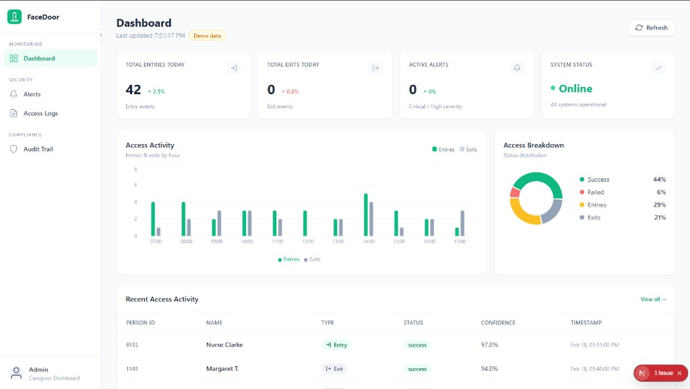
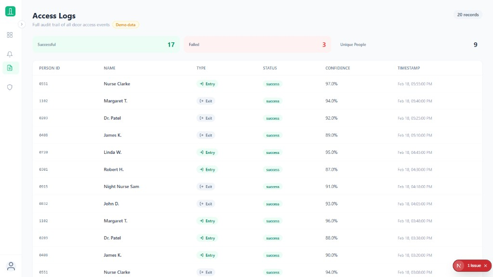

# FaceDoor — Smart Door Security System

A facial recognition-based access control and monitoring system designed for elderly care facilities. It identifies residents and staff at entry points, logs every access event, detects behavioural anomalies, monitors for falls, and surfaces everything through a modern web dashboard.

---

## Table of Contents

- [Overview](#overview)
- [Architecture](#architecture)
- [Tech Stack](#tech-stack)
- [Project Structure](#project-structure)
- [Getting Started](#getting-started)
  - [Prerequisites](#prerequisites)
  - [1. Backend (Flask API)](#1-backend-flask-api)
  - [2. Frontend (Next.js)](#2-frontend-nextjs)
- [Usage](#usage)
  - [Registering Faces](#registering-faces)
  - [Running the System](#running-the-system)
  - [Fall Detection (Live Camera)](#fall-detection-live-camera)
  - [Diagnostics](#diagnostics)
- [API Reference](#api-reference)
- [Dashboard Pages](#dashboard-pages)
- [Screenshots](#screenshots)
- [Configuration](#configuration)
- [Compliance](#compliance)
- [Scripts](#scripts)

---

## Overview

FaceDoor provides:

- **Facial Recognition** — detects and identifies people at the door using HOG feature extraction and Euclidean distance matching (85–95% accuracy, runs on Raspberry Pi)
- **Threat Detection** — rules-based alerts for failed access attempts, unusual hours, unrecognised faces, and frequency spikes
- **Anomaly Detection** — Isolation Forest ML model flags unusual behavioural patterns (e.g. inactivity, off-hours access, failed access bursts)
- **Fall Detection** — real-time rules-based fall detector using MediaPipe Pose skeleton tracking; detects falls via hip height, torso angle, and drop velocity
- **Audit Logging** — every system action is logged for PIPEDA / GDPR compliance
- **Live Dashboard** — real-time monitoring of entries/exits, alerts, falls, and audit trail via a Next.js web app

---

## Architecture

```
┌─────────────────────────────┐        ┌──────────────────────────────────┐
│   Next.js Frontend          │        │   Flask REST API                 │
│   localhost:3000            │◄──────►│   localhost:5001                 │
│                             │  HTTP  │                                  │
│  Dashboard  /               │        │  /api/recognize                  │
│  Alerts     /alerts         │        │  /api/logs                       │
│  Logs       /logs           │        │  /api/threats                    │
│  Falls      /falls          │        │  /api/stats                      │
│  Audit      /compliance     │        │  /api/compliance/audit           │
└─────────────────────────────┘        │  /api/fall/detect                │
                                       │  /api/fall/events                │
                                       │  /api/fall/status                │
                                       └──────────────┬───────────────────┘
                                                      │
                              ┌───────────────────────▼───────────────────┐
                              │   SQLite Database  (data/doorface.db)     │
                              │   Tables: users, access_logs,             │
                              │           threats, anomalies,             │
                              │           audit_logs,                     │
                              │           behavioral_profiles             │
                              └───────────────────────────────────────────┘
```

The Next.js dev server proxies all `/api/*` requests to Flask automatically — no CORS issues during development.

---

## Tech Stack

| Layer              | Technology                                          |
|--------------------|-----------------------------------------------------|
| Backend            | Python 3.9+, Flask 3.x                             |
| Computer Vision    | OpenCV 4.x (Haar Cascade, HOG)                     |
| Pose Estimation    | MediaPipe 0.10 (PoseLandmarker — Tasks API)        |
| Machine Learning   | scikit-learn (Isolation Forest), StandardScaler    |
| Database           | SQLite via `sqlite3`                               |
| Frontend           | Next.js 15 (App Router), React 19, TypeScript      |
| Styling            | Tailwind CSS                                        |
| Charts             | Recharts                                            |
| Target Hardware    | Raspberry Pi 4 / Jetson Nano                       |

---

## Project Structure

```text
Implementation/
│
├── main.py                          # Flask app entry point
├── config.py                        # Configuration constants
├── requirements.txt                 # Python dependencies
│
├── api/                             # REST API layer
│   ├── __init__.py                  # Flask app factory — loads all models at startup
│   ├── routes.py                    # Core endpoints (recognize, logs, threats, stats)
│   ├── facial_recognition.py        # HOG face detection & matching engine
│   ├── fall_detection_routes.py     # Fall detection endpoints (/api/fall/...)
│   └── threat_detection.py          # Rules-based threat scoring
│
├── models/                          # ML models
│   ├── anomaly_detection.py         # Isolation Forest anomaly detector
│   ├── isolation_forest.pkl         # Trained Isolation Forest model artifact
│   ├── fall_detection.py            # FallDetector class (MediaPipe rules-based)
│   └── pose_landmarker.task         # MediaPipe pre-trained pose skeleton model
│
├── data/                            # Data layer
│   ├── database.py                  # SQLite manager (all DB read/write operations)
│   ├── data_generator.py            # Synthetic training data generator
│   ├── doorface.db                  # SQLite database (auto-created, gitignored)
│   ├── synthetic_dataset.csv        # Generated training data for anomaly model
│   └── samples/                     # Captured face photos per person
│       └── {person_name}/
│           └── *.jpg / *.png
│
├── frontend/                        # Next.js dashboard (App Router)
│   ├── app/
│   │   ├── layout.tsx               # Root layout with sidebar
│   │   ├── page.tsx                 # Main dashboard (stats + charts)
│   │   ├── alerts/page.tsx          # Security alerts feed
│   │   ├── falls/page.tsx           # Fall detection history & live status
│   │   ├── logs/page.tsx            # Access logs + registered people
│   │   └── compliance/page.tsx      # Audit trail (PIPEDA compliance)
│   ├── components/
│   │   ├── Sidebar.tsx              # Collapsible nav sidebar
│   │   ├── StatCard.tsx             # KPI stat cards
│   │   ├── AccessChart.tsx          # Bar chart (entries/exits by hour)
│   │   ├── StatusDonut.tsx          # Donut chart (access breakdown)
│   │   ├── AccessLogsTable.tsx      # Paginated access log table
│   │   ├── AlertList.tsx            # Threat alert cards list
│   │   ├── AuditTable.tsx           # Compliance audit table
│   │   └── StatusBadge.tsx          # Small status pill component
│   ├── lib/
│   │   ├── api.ts                   # Typed API client (all fetch wrappers)
│   │   └── demoData.ts              # Demo data when DB is empty
│   ├── next.config.ts               # API proxy (frontend → Flask :5001)
│   ├── tailwind.config.ts           # Tailwind design tokens
│   └── package.json
│
├── scripts/                         # Utility scripts (run from project root)
│   ├── fall_detection_camera.py     # Live webcam fall detection (Phase 1)
│   ├── capture_faces.py             # Capture face photos from webcam
│   ├── register_faces.py            # Register faces into DB + extract encodings
│   ├── clear_database.py            # Reset the SQLite DB (preserves samples/)
│   ├── diagnose_recognition.py      # Full system diagnostics tool
│   ├── quick_test_recognition.py    # Quick recognition sanity check
│   └── train_anomaly_detection.py   # Generate data and train Isolation Forest
│
├── tests/                           # Test scripts (run from project root)
│   ├── test_api_recognize.py        # API-level tests for /api/recognize
│   ├── test_face_recognition_real.py
│   ├── test_facial_recognition.py
│   └── test_integration.py          # End-to-end integration tests
│
├── docs/                            # Architecture, API, deployment, guides
│   ├── ARCHITECTURE.md
│   ├── API_DOCS.md
│   ├── DEPLOYMENT.md
│   ├── FACIAL_RECOGNITION_GUIDE.md
│   ├── GET_STARTED.md
│   ├── SECURITY.md
│   ├── TRAINING_GUIDE.md
│   └── images/
│
└── screenshots/                     # UI screenshots for reports / README
    ├── dashboard.png
    ├── access-logs.png
    ├── alerts.png
    └── audit-trail.png
```

---

## Getting Started

> **Important:** Always run commands from the **`Implementation/`** directory. Scripts and the Flask app expect to find `data/`, `api/`, and `models/` relative to the current working directory.

### Prerequisites

| Tool    | Version | Download                |
|---------|---------|-------------------------|
| Python  | 3.9+    | https://www.python.org  |
| Node.js | 18+ LTS | https://nodejs.org      |
| npm     | 9+      | Included with Node.js   |

### 1. Backend (Flask API)

```bash
# Install Python dependencies
pip install -r requirements.txt

# Download the MediaPipe pose model (one-time, ~9 MB)
curl -L -o models/pose_landmarker.task \
  https://storage.googleapis.com/mediapipe-models/pose_landmarker/pose_landmarker_full/float16/1/pose_landmarker_full.task

# Start the API server (use python3 on macOS/Linux)
python main.py
```

Flask API will be available at **http://localhost:5001**

### 2. Frontend (Next.js)

Open a **second terminal**:

```bash
cd frontend

# Install Node dependencies (first time only)
npm install

# Start the dev server
npm run dev
```

Dashboard will be available at **http://localhost:3000**

> Both servers must be running at the same time. The frontend proxies all `/api/*` calls to Flask automatically.

---

## Usage

### Registering Faces

Before the system can recognise anyone, register faces:

```bash
# Step 1 — capture face photos from your webcam
python scripts/capture_faces.py

# Step 2 — register the captured photos into the database
python scripts/register_faces.py
```

The system will prompt for a name, capture several photos, extract HOG features, and store them in `data/samples/` and the SQLite database.

### Running the System

Once faces are registered:

1. Start Flask: `python main.py`
2. Start Next.js: `cd frontend && npm run dev`
3. Open **http://localhost:3000**
4. Point a camera feed at the door — the `/api/recognize` endpoint accepts base64-encoded frames

### Fall Detection (Live Camera)

Run the standalone fall detection monitor (no Flask required):

```bash
python scripts/fall_detection_camera.py
```

A window opens showing your webcam with a skeleton overlay. The banner turns **red** and shows "FALL DETECTED" when a fall is detected.

**Options:**
```bash
python scripts/fall_detection_camera.py --camera 1       # use a different camera
python scripts/fall_detection_camera.py --threshold 0.6  # adjust sensitivity (default 0.55)
python scripts/fall_detection_camera.py --log falls.csv  # save fall events to CSV
python scripts/fall_detection_camera.py --no-display     # headless / no window
```

**Controls while running:**
- `Q` — quit
- `S` — save screenshot to `screenshots/`
- `R` — reset fall history

**How it works (Phase 1 — Rules-Based):**

MediaPipe extracts 33 body skeleton landmarks per frame. Three rules are scored and combined:

| Rule | Weight | Trigger |
|------|--------|---------|
| Hip height | 40% | Hips near bottom of frame (person on floor) |
| Torso angle | 35% | Spine tilted > 50° from vertical |
| Drop velocity | 25% | Hips dropped rapidly across recent frames |

When combined confidence ≥ 0.55 → fall is declared. Fall events are logged to the `anomalies` table in the database.

> **Phase 2 (planned):** LSTM model trained on the UR Fall Detection dataset for higher accuracy across diverse fall types.

### Diagnostics

If recognition is not working:

```bash
python scripts/diagnose_recognition.py
```

Checks camera connectivity, face detection, stored samples, recognition accuracy, and database health.

---

## API Reference

All endpoints are prefixed with `/api`.

### Core Endpoints

| Method | Endpoint            | Description                          |
|--------|---------------------|--------------------------------------|
| GET    | `/health`           | Health check                         |
| POST   | `/recognize`        | Recognize a face from a camera frame |
| POST   | `/log-access`       | Log an access event manually         |
| GET    | `/logs`             | Get access logs (paginated)          |
| GET    | `/threats`          | Get active security threats          |
| GET    | `/stats`            | System statistics                    |
| GET    | `/compliance/audit` | PIPEDA audit log                     |

### Fall Detection Endpoints

| Method | Endpoint         | Description                                      |
|--------|------------------|--------------------------------------------------|
| POST   | `/fall/detect`   | Analyse a base64 frame for falls                 |
| GET    | `/fall/events`   | List recent fall events from DB                  |
| GET    | `/fall/status`   | Detector health and config                       |
| POST   | `/fall/reset`    | Clear velocity history and cooldown              |

### Example — Recognize a face

```bash
curl -X POST http://localhost:5001/api/recognize \
  -H "Content-Type: application/json" \
  -d '{"frame": "<base64_encoded_image>"}'
```

Response:
```json
{
  "person_id": "resident_001",
  "name": "Margaret T.",
  "confidence": 0.94,
  "access_granted": true,
  "timestamp": "2026-03-08T14:30:00"
}
```

### Example — Get fall events

```bash
curl "http://localhost:5001/api/fall/events?limit=10"
```

Response:
```json
{
  "events": [
    {
      "anomaly_id": 12,
      "anomaly_type": "fall_detected",
      "anomaly_score": 0.78,
      "description": "Fall detected: hips low (0.81); torso tilted 67°",
      "timestamp": "2026-03-08T21:30:00"
    }
  ],
  "count": 1
}
```

---

## Dashboard Pages

| Page        | URL           | Description                                                       |
|-------------|---------------|-------------------------------------------------------------------|
| Dashboard   | `/`           | KPI cards (including falls today), hourly chart, recent logs      |
| Alerts      | `/alerts`     | Active threats filtered by ALL / HIGH / CRITICAL severity         |
| Falls       | `/falls`      | Fall detection history, confidence scores, detector live status   |
| Access Logs | `/logs`       | Full paginated access log with entry/exit badges                  |
| Audit Trail | `/compliance` | PIPEDA-compliant audit log with CSV export                        |

> **Demo mode:** When the database has no registered faces, pages automatically show realistic demo data. A yellow `Demo data` badge appears in the page header.

---

## Screenshots

### Dashboard


### Alerts


### Access Logs


### Audit Trail


---

## Configuration

All system settings live in `config.py`:

| Setting                       | Default            | Description                                   |
|-------------------------------|--------------------|-----------------------------------------------|
| `CONFIDENCE_THRESHOLD`        | `0.6`              | Minimum face match confidence to grant access |
| `FAILED_ATTEMPTS_THRESHOLD`   | `3`                | Failed attempts before threat alert           |
| `INACTIVITY_THRESHOLD_HOURS`  | `24`               | Hours without access before alert             |
| `UNUSUAL_HOURS`               | `22:00 – 06:00`    | Hours flagged as unusual access               |
| `ANOMALY_SCORE_THRESHOLD`     | `0.7`              | Isolation Forest score cutoff                 |
| `DATABASE_PATH`               | `data/doorface.db` | SQLite file location                          |
| `TARGET_DEVICE`               | `raspberry_pi`     | Hardware target for optimisation              |

Fall detection thresholds are tunable at the top of `models/fall_detection.py`:

| Setting                  | Default | Description                              |
|--------------------------|---------|------------------------------------------|
| `FALL_THRESHOLD`         | `0.55`  | Weighted confidence to declare a fall    |
| `HIP_HEIGHT_THRESHOLD`   | `0.72`  | Normalised y position considered "floor" |
| `TORSO_ANGLE_THRESHOLD`  | `50°`   | Degrees from vertical = lying down       |
| `VELOCITY_THRESHOLD`     | `0.07`  | Normalised drop per frame = fast fall    |
| `VELOCITY_WINDOW`        | `8`     | Frames tracked for velocity calculation  |

---

## Compliance

FaceDoor is designed with **PIPEDA** (Canada) and **GDPR** compliance in mind:

- All face data is processed and stored **locally** — no cloud uploads
- Every system action is written to the `audit_logs` table with actor, resource, and result
- Audit logs are exportable as CSV from the Compliance page
- Face images are stored only in `data/samples/` and can be deleted on request
- Recognition confidence scores are logged for accountability

---

## Scripts

| Script                                | Purpose                                                    |
|---------------------------------------|------------------------------------------------------------|
| `scripts/fall_detection_camera.py`    | Live webcam fall detection with skeleton overlay (Phase 1) |
| `scripts/capture_faces.py`            | Capture face photos from webcam for registration           |
| `scripts/register_faces.py`           | Register captured photos, extract HOG features             |
| `scripts/clear_database.py`           | Reset the SQLite DB (preserves `data/samples/`)            |
| `scripts/diagnose_recognition.py`     | Full system diagnostics (camera, DB, recognition)          |
| `scripts/quick_test_recognition.py`   | Quick test: photo + live webcam recognition                |
| `scripts/train_anomaly_detection.py`  | Generate synthetic data and retrain Isolation Forest       |
| `tests/test_facial_recognition.py`    | Component-level recognition unit tests                     |
| `tests/test_face_recognition_real.py` | Extended webcam + photo recognition tests                  |
| `tests/test_integration.py`           | End-to-end pipeline integration tests                      |
| `tests/test_api_recognize.py`         | API-level tests for `/api/recognize`                       |

---

## Douglas College CSIS 4495 — Applied Research Project

© 2026 Douglas College. Built for elderly care facilities.
