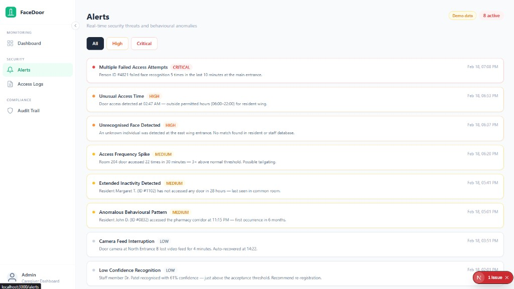
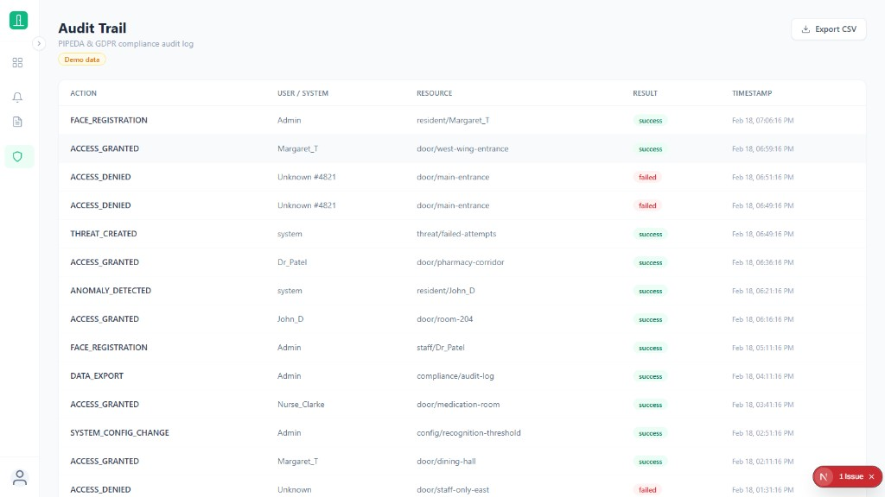

# FaceDoor — Smart Door Security System

A facial recognition-based access control and monitoring system designed for elderly care facilities. It identifies residents and staff at entry points, logs every access event, detects security threats, and surfaces everything through a modern web dashboard.

---

## Table of Contents

- [Overview](#overview)
- [Architecture](#architecture)
- [Tech Stack](#tech-stack)
- [Project Structure](#project-structure)
- [Getting Started](#getting-started)
- [Usage](#usage)
  - [Registering Faces](#registering-faces)
  - [Running the System](#running-the-system)
  - [Diagnostics](#diagnostics)
- [API Reference](#api-reference)
- [Dashboard Pages](#dashboard-pages)
- [Scripts](#scripts)
- [Configuration](#configuration)
- [Compliance](#compliance)
- [Screenshots](#screenshots)

---

## Repository Guidelines

This GitHub repo follows the CSIS‑4495 requirements:

* **Name format:** `W26_4495_S3_FirstNameLastInitial` (e.g. `W26_4495_S3_AdvitiyaS`).
  The team lead (or lone student) owns the repo and is responsible for all joint
  submissions.
* **Default branch:** `main` – please work and push changes there.
* **Add the instructor** (`kandhadaip@douglascollege.ca`) as a collaborator to the
  repository.

## Repository Layout

This project follows the course guidelines for GitHub submissions. The top-level
folders are:

- `Implementation/` – **all source code and scripts** live here; run from within
  this directory when starting the backend or frontend.
- `ReportsAndDocuments/` – contains design docs, architecture notes, and the
  midterm/final reports (including `MidtermReport.md`).
- `README.md` – you are reading it now.

(There are also a couple of legacy folders at the root for compatibility, but
all active development occurs under `Implementation/`.)

The default branch for development is **main**; please ensure you are working
and pushing to `main` and that the instructor is added as a collaborator.

## Overview

FaceDoor provides:

- **Facial Recognition** — detects and identifies people at the door using HOG feature extraction and Euclidean distance matching (85–95% accuracy, runs on Raspberry Pi)
- **Threat Detection** — rules-based alerts for failed access attempts, unusual hours, unrecognised faces, and frequency spikes
- **Anomaly Detection** — Isolation Forest ML model flags unusual behavioural patterns (e.g. inactivity, off-hours access)
- **Audit Logging** — every system action is logged for PIPEDA / GDPR compliance
- **Live Dashboard** — real-time monitoring of entries/exits, alerts, and audit trail via a Next.js web app

---

## Architecture

```
┌─────────────────────────────┐        ┌──────────────────────────────┐
│   Next.js Frontend          │        │   Flask REST API             │
│   localhost:3000            │◄──────►│   localhost:5000             │
│                             │  HTTP  │                              │
│  Dashboard  /               │        │  /api/recognize              │
│  Alerts     /alerts         │        │  /api/logs                   │
│  Logs       /logs           │        │  /api/threats                │
│  Audit      /compliance     │        │  /api/stats                  │
└─────────────────────────────┘        │  /api/compliance/audit       │
                                       └──────────────┬───────────────┘
                                                      │
                              ┌───────────────────────▼───────────────┐
                              │  SQLite Database  (data/doorface.db)  │
                              │  Tables: users, access_logs,          │
                              │          threats, anomalies,          │
                              │          audit_logs,                  │
                              │          behavioral_profiles          │
                              └───────────────────────────────────────┘
```

The Next.js dev server proxies all `/api/*` requests to Flask automatically — no CORS issues during development.

---

## Tech Stack

| Layer             | Technology                                      |
|-------------------|-------------------------------------------------|
| Backend           | Python 3.12, Flask 3.x                         |
| Computer Vision   | OpenCV 4.x (Haar Cascade, HOG)                 |
| Machine Learning  | scikit-learn (Isolation Forest)                 |
| Database          | SQLite via `sqlite3`                            |
| Frontend          | Next.js 16 (App Router), React 19, TypeScript  |
| Styling           | Tailwind CSS                                    |
| Charts            | Recharts                                        |
| Target Hardware   | Raspberry Pi 4 / Jetson Nano                   |

---

## Project Structure

At a high level:

- **Backend API** in `api/`, `data/`, `models/`, wired up by `main.py`
- **Next.js dashboard** in `frontend/`
- **Scripts** in `scripts/` (capture, register, diagnose, train, etc.)
- **Tests** in `tests/`
- **Docs** in `docs/`

```text
project-root/
│
├── main.py                        # Flask app entry point (API only)
├── config.py                      # Configuration constants
├── requirements.txt               # Python dependencies
│
├── api/                           # REST API + recognition logic
│   ├── __init__.py                # Flask app factory + CORS setup
│   ├── routes.py                  # REST API endpoints (/api/...)
│   ├── facial_recognition.py      # Face detection & matching engine
│   └── threat_detection.py        # Rules-based threat detection
│
├── data/                          # Data layer + samples
│   ├── database.py                # SQLite manager (all DB operations)
│   ├── data_generator.py          # Synthetic training data generator
│   ├── doorface.db                # SQLite database (auto-created)
│   └── samples/                   # Captured face photos
│       └── {person_name}/
│           └── *.jpg / *.png
│
├── models/
│   ├── anomaly_detection.py       # Isolation Forest anomaly detector
│   └── isolation_forest.pkl       # Trained model artifact
│
├── frontend/                      # Next.js dashboard (App Router)
│   ├── app/
│   │   ├── layout.tsx             # Root layout with sidebar
│   │   ├── page.tsx               # Main dashboard (stats + charts)
│   │   ├── alerts/page.tsx        # Security alerts feed
│   │   ├── logs/page.tsx          # Access logs + “Registered People”
│   │   └── compliance/page.tsx    # Audit trail (compliance)
│   ├── components/
│   │   ├── Sidebar.tsx            # Collapsible nav sidebar
│   │   ├── StatCard.tsx           # KPI stat cards
│   │   ├── AccessChart.tsx        # Bar chart (entries/exits by hour)
│   │   ├── StatusDonut.tsx        # Donut chart (access breakdown)
│   │   ├── AccessLogsTable.tsx    # Paginated access log table
│   │   ├── AlertList.tsx          # Threat alert cards list
│   │   ├── AuditTable.tsx         # Compliance audit table
│   │   └── StatusBadge.tsx        # Small status pill component
│   ├── lib/
│   │   ├── api.ts                 # Typed API client (fetch wrappers)
│   │   └── demoData.ts            # Demo data when DB is empty
│   ├── next.config.ts             # API proxy (frontend ↔ Flask)
│   ├── tailwind.config.ts         # Tailwind design system
│   └── package.json
│
├── scripts/                       # Utility scripts (run from project root)
│   ├── capture_faces.py           # Capture face photos from webcam
│   ├── register_faces.py          # Register faces into DB + encodings
│   ├── clear_database.py          # Reset the SQLite DB (keep samples/)
│   ├── diagnose_recognition.py   # System diagnostics tool
│   ├── quick_test_recognition.py # Quick recognition test
│   └── train_anomaly_detection.py# Train ML models
│
├── tests/                         # Test scripts (run from project root)
│   ├── test_api_recognize.py      # API-level tests for /api/recognize
│   ├── test_face_recognition_real.py
│   ├── test_facial_recognition.py
│   └── test_integration.py       # End-to-end integration tests
│
├── docs/                          # Architecture, API, deployment, guides
│   ├── ARCHITECTURE.md
│   ├── API_DOCS.md
│   ├── DEPLOYMENT.md
│   ├── FACIAL_RECOGNITION_GUIDE.md
│   ├── GET_STARTED.md
│   ├── SECURITY.md
│   ├── TRAINING_GUIDE.md
│   └── images/                   # Doc images
│
├── screenshots/                   # UI screenshots for reports/README
│   ├── dashboard.png
│   ├── access-logs.png
│   ├── alerts.png
│   └── audit-trail.png
│
└── dashboard/                     # Legacy static HTML dashboard (unused)
    ├── templates/
    └── static/
```

---

## Getting Started

> **Run all commands from the project root.**

### Prerequisites

| Tool       | Version | Notes                        |
|------------|---------|------------------------------|
| Python     | 3.12+   | pip included                 |
| Node.js    | 18+ LTS | npm included                 |

### Installation

```bash
# clone repository and enter the project root
git clone https://github.com/advitiyasharda/W26_4495_S3_AdvitiyaS.git
cd W26_4495_S3_AdvitiyaS

# change into the Implementation folder where all source code lives
cd Implementation

# install backend dependencies
pip install -r requirements.txt
python -c "import data.database as db; db.init_db('data/doorface.db')"
# (optional) populate sample faces for demo
python scripts/register_faces.py --samples data/samples

# install frontend dependencies
cd frontend
npm install
cd ..
```

### Starting the system

From within the `Implementation` directory, open two terminals:

```bash
# terminal 1: start backend
python main.py

# terminal 2: start frontend
cd frontend && npm run dev
```

Backend: http://localhost:5000  
Frontend: http://localhost:3000


## Usage

To see a demo of the system you can use the sample dataset included in `data/samples/` and then run the backend and frontend as described above. Once both servers are running you can interact with the dashboard to view access logs, watch alerts trigger when unknown faces are sent to `/api/recognize`, and check the health endpoint.

### Registering Faces

Before the system can recognise anyone, you need to register faces:

```bash
# Step 1 — capture face photos from your webcam
python scripts/capture_faces.py

# Step 2 — register the captured photos into the database
python scripts/register_faces.py
```

The system will prompt for a name, capture several photos, extract HOG features, and store them in `data/samples/` and the SQLite database.

### Running the System

Once faces are registered:

1. Start the Flask API: `python main.py`
2. Start the Next.js dashboard: `cd frontend && npm run dev`
3. Open **http://localhost:3000**
4. Point a camera feed at the door — the `/api/recognize` endpoint accepts base64-encoded frames

### Diagnostics

If recognition is not working:

```bash
python scripts/diagnose_recognition.py
```

This checks camera connectivity, face detection, stored samples, recognition accuracy, and database health.

---

## API Reference

All endpoints are prefixed with `/api`.

| Method | Endpoint              | Description                          |
|--------|-----------------------|--------------------------------------|
| GET    | `/health`             | Health check                         |
| POST   | `/recognize`          | Recognize a face from a camera frame |
| POST   | `/log-access`         | Log an access event                  |
| GET    | `/logs`               | Get access logs (paginated)          |
| GET    | `/threats`            | Get active security threats          |
| GET    | `/stats`              | System statistics                    |
| GET    | `/compliance/audit`   | PIPEDA audit log                     |

### Example — Recognize a face

```bash
curl -X POST http://localhost:5000/api/recognize \
  -H "Content-Type: application/json" \
  -d '{"frame": "<base64_encoded_image>"}'
```

Response:
```json
{
  "person_id": "resident_001",
  "name": "Margaret T.",
  "confidence": 0.94,
  "access_granted": true,
  "timestamp": "2026-02-17T14:30:00"
}
```

### Example — Get access logs

```bash
curl "http://localhost:5000/api/logs?limit=20"
```

---

## Dashboard Pages

| Page        | URL           | Description                                                      |
|-------------|---------------|------------------------------------------------------------------|
| Dashboard   | `/`           | KPI cards, hourly bar chart, access breakdown donut, recent logs |
| Alerts      | `/alerts`     | Active threats filtered by ALL / HIGH / CRITICAL severity        |
| Access Logs | `/logs`       | Full paginated access log with entry/exit badges                 |
| Audit Trail | `/compliance` | PIPEDA-compliant audit log with CSV export                       |

> **Demo mode:** When the database has no registered faces, all pages automatically show realistic demo data. A yellow `Demo data` badge appears in the page header. Demo data disappears as soon as real users are registered.

---

## Screenshots

### Dashboard


### Alerts


### Access Logs


### Audit Trail


---

## Configuration

All system settings live in `config.py`:

| Setting                        | Default          | Description                                  |
|--------------------------------|------------------|----------------------------------------------|
| `CONFIDENCE_THRESHOLD`         | `0.6`            | Minimum face match confidence to grant access |
| `FAILED_ATTEMPTS_THRESHOLD`    | `3`              | Failed attempts before alert                 |
| `INACTIVITY_THRESHOLD_HOURS`   | `24`             | Hours without access before alert            |
| `UNUSUAL_HOURS`                | `22:00 – 06:00`  | Hours flagged as unusual access              |
| `ANOMALY_SCORE_THRESHOLD`      | `0.7`            | Isolation Forest score cutoff                |
| `DATABASE_PATH`                | `data/doorface.db` | SQLite file location                       |
| `TARGET_DEVICE`                | `raspberry_pi`   | Hardware target for optimisation             |

---

## Compliance

FaceDoor is designed with **PIPEDA** (Canada) and **GDPR** compliance in mind:

- All face data is processed and stored **locally** — no cloud uploads
- Every system action is written to the `audit_logs` table with actor, resource, and result
- Audit logs are exportable as CSV from the Compliance page
- Face images are stored only in `data/samples/` and can be deleted on request
- Recognition confidence scores are logged for accountability

---

## Scripts

| Script                        | Purpose                                            |
|-------------------------------|----------------------------------------------------|
| `scripts/capture_faces.py`            | Capture face photos from webcam for registration   |
| `scripts/register_faces.py`           | Register captured photos, extract HOG features     |
| `scripts/clear_database.py`          | Reset the SQLite DB (keep samples/)                |
| `scripts/diagnose_recognition.py`     | Full system diagnostics (camera, DB, recognition)  |
| `scripts/quick_test_recognition.py`   | Quick test: photo + live webcam recognition        |
| `scripts/train_anomaly_detection.py`  | Generate synthetic data and train Isolation Forest |
| `tests/test_facial_recognition.py`    | Component-level recognition tests                  |
| `tests/test_face_recognition_real.py` | Extended webcam + photo recognition tests          |
| `tests/test_integration.py`           | End-to-end pipeline integration tests              |
| `tests/test_api_recognize.py`         | API-level tests for /api/recognize (webcam)        |

---

## Douglas College CSIS 4495 — Applied Research Project

© 2026 Douglas College. Built for elderly care facilities.
